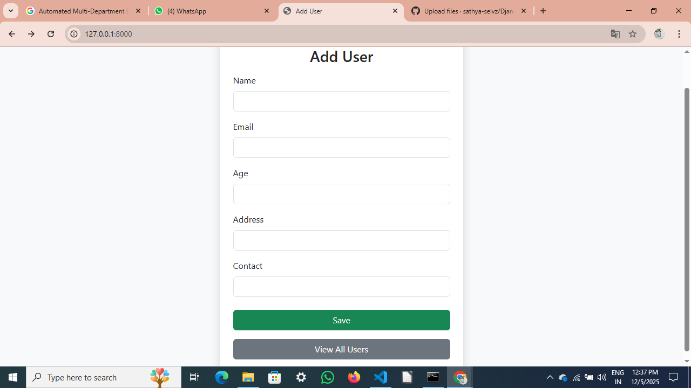
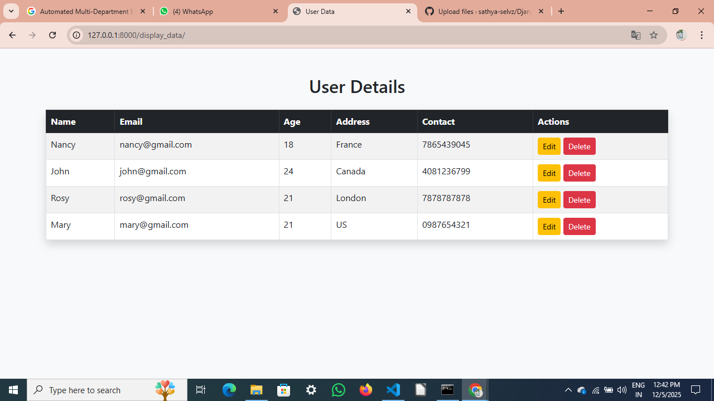
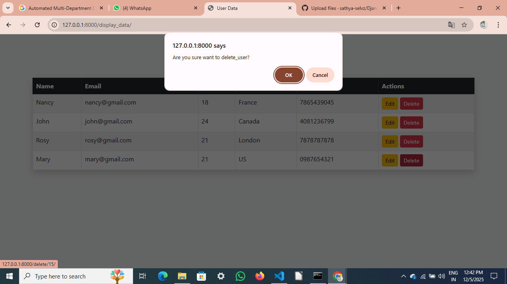

#  Django - User Management System

[](https://www.python.org/)
[](https://www.mysql.com/)
[](https://getbootstrap.com/)

---

## 🚀 Project Overview

**MyProject** is a **User Management System** built with **Django, Python, MySQL, and Bootstrap**.
It provides a **full CRUD interface** for managing users and their profiles with a responsive and modern design.

---

## 🔹 Features

* ✅ Add new users with personal details (name, email, age, etc.)
* ✅ View all users in a responsive table
* ✅ Edit and update user information
* ✅ Delete users along with their associated profile data
* ✅ Responsive UI using **Bootstrap**
* ✅ Secure and efficient **MySQL Workbench** integration
* ✅ Optional **Admin Panel** for superuser management

---

## 🛠 Technology Stack

| Layer    | Technology           |
| -------- | -------------------- |
| Backend  | Django (Python)      |
| Frontend | HTML, CSS, Bootstrap |
| Database | MySQL Workbench      |
| Language | Python 3.x           |
| Others   | Git, GitHub          |

---

## 📥 Installation & Setup

### Prerequisites

* Python 3.x
* MySQL Server & MySQL Workbench
* pip (Python package manager)

### Steps

1. **Clone the repository**:

```bash
git clone <https://github.com/sathya-selvz/Django-Mysql-User-Management/tree/main>
```

2. **Navigate to project folder**:

```bash
cd myproject
```

3. **Create and activate virtual environment**:

```bash
python -m venv env
# Windows
env\Scripts\activate
# Linux/Mac
source env/bin/activate
```

4. **Install dependencies**:

```bash
pip install -r requirements.txt
```

5. **Configure MySQL database** in `MyProject/settings.py`:

```python
DATABASES = {
    'default': {
        'ENGINE': 'django.db.backends.mysql',
        'NAME': 'your_db_name',
        'USER': 'your_db_user',
        'PASSWORD': 'your_db_password',
        'HOST': 'localhost',
        'PORT': '3306',
    }
}
```

6. **Apply migrations**:

```bash
python manage.py makemigrations
python manage.py migrate
```

7. **Create superuser** (optional for admin panel):

```bash
python manage.py createsuperuser
```

8. **Run the development server**:

```bash
python manage.py runserver
```

9. **Open in browser**:

```
http://127.0.0.1:8000/
```

---

## 📂 Project Structure

```
MyProject/
│
├── myapp/                  # Django app for user management
│   ├── templates/          # HTML templates,bootstrap,css             
│   ├── models.py           # Database models
│   ├── views.py            # Views & CRUD operations
│   ├── urls.py             # App URL routing
│   └── forms.py            # Django forms
│
├── MyProject/              # Main Django project folder
│   ├── settings.py         # Project settings
│   ├── urls.py             # Project URL routing
│   └── wsgi.py
│
├── manage.py               # Django management script
└── requirements.txt        # Project dependencies
```

---
## 🖼 Screenshots

### 📌 Add User Page  
<p align="center">
  
</p>

### 📌 User List Page
<p align="center">
  
</p>

### 📌 Edit User Page
<p align="center">
  
</p>

### 📌 Delete User Page
<p align="center">
  
</p>

---

## 🤝 Contributing

1. Fork the repository
2. Create a new branch for your feature (`git checkout -b feature-name`)
3. Make your changes and commit (`git commit -m "Add feature"`)
4. Push to your fork (`git push origin feature-name`)
5. Open a Pull Request

---

## 📄 License

This project is **open-source** and free to use.

---

